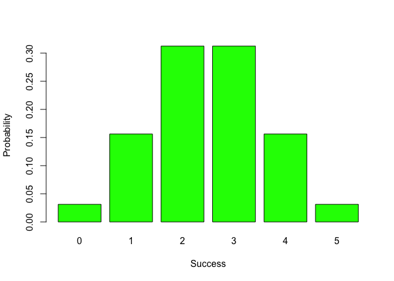

README.Rmd
================
Uzziel Valencia
5/3/2019

Brief Introduction
------------------

### Welcome the Binomial Package!

This is a minor package that will help you to do all matter of computation with *binomial probabilities*.

The main functions in this package are the following:

-   **bin\_choose( )**: Giving the number of successes in a given number of trials
-   **bin\_probability( )**: Computing the binomial probability under specified conditions
-   **bin\_distribution( )**: Gives a dataframe with the listed successes and their probabilities
-   **bin\_cumulative( )**: Gives a dataframe with the listed successes, thier probabilities, and a cumulative count of probabilities
-   **bin\_variable( )**: Returns a list of all the relevant variables of a binomial distribution

### How to Install

In order to install the package, you will need to use the **devtools** package.

``` r
install.packages("devtools") 
```

Then you can install this package from github:

``` r
devtools::install_github("stat133-sp19/hw-stat133-UzzielV/tree/master/binomial")
```

If you want to see the fancy-shmancy vignette I built too, you can run the following code:

``` r
devtools::install_github("stat133-sp19/hw-stat133-UzzielV/tree/master/binomial", build_vignettes = TRUE)
```

### Now, let's use it!

Running **bin\_choose( )**:

``` r
library(binomial)
bin_choose( n = 5, k = 2)
```

    ## [1] 10

Running **bin\_probability( )**:

``` r
bin_probability(k = 2, n = 5, p = 0.5)
```

    ## [1] 0.3125

Getting a distribution in a data.frame **bin\_probability( )**:

``` r
bin1 <- bin_distribution(n = 5, p = 0.5)
bin1
```

    ##   success probability
    ## 1       0     0.03125
    ## 2       1     0.15625
    ## 3       2     0.31250
    ## 4       3     0.31250
    ## 5       4     0.15625
    ## 6       5     0.03125

Plotting that distribution **plot( )**:

``` r
plot(bin1)
```



Getting cumulative frequencies **bin\_cumulative( )**:

``` r
bin_cumulative( n = 5, p = 0.5)
```

    ##   success probability cumulative
    ## 1       0     0.03125    0.03125
    ## 2       1     0.15625    0.18750
    ## 3       2     0.31250    0.50000
    ## 4       3     0.31250    0.81250
    ## 5       4     0.15625    0.96875
    ## 6       5     0.03125    1.00000

Inspecting our variables **bin\_variable( )**:

``` r
bin_variable(n = 5, p = 0.5)
```

    ## "Binomial Variable"
    ## 
    ## Parameters
    ##  Number of Trials: 5
    ##  Probability of Success: 0.5

Summarizing the parameters of our binomial variables:

``` r
bin1 <- bin_variable( n = 10, p = 0.3)
binsum <- summary(bin1)
binsum
```

    ## "Summary Binomial"
    ## 
    ## Parameters
    ##  -number of trials: 10
    ##  -prob of success: 0.3
    ## 
    ## Measures
    ##  -mean: 3
    ##  -variance: 2.1
    ##  -mode: 3
    ##  -skewness: 0.2760262
    ##  -kurtosis: -0.1238095
